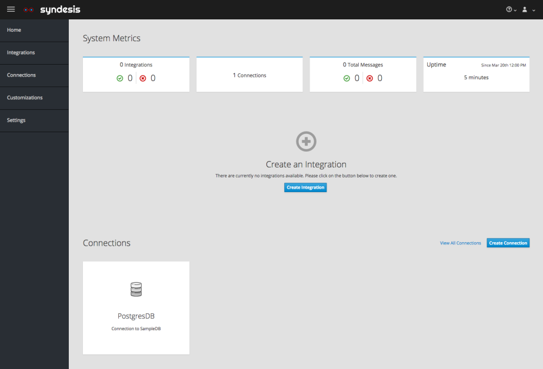

You can try out Syndesis very easily locally, too.
All you need is a [Minishift](https://www.openshift.org/minishift/) installation which is available for all the  major operating systems (Linux, OS X and Windows).
The following examples assume that you have Minishift installed and can be called with `minishift` from the command line. So, `minishift` is supposed to be available in your search path, i.e. located in a directory contained in your `$PATH` environment variable (Linux, macOS) or in a directory from your system path (Windows).

## Rocket launch

To make the installation super easy, on macOS and Linux you can use the following command for a complete installation of Syndesis on Minishift in the namespace `syndesis`, which will be created on the fly if it does not exist:

```bash
bash <(curl -sL https://syndes.is/start)
```

This will take some time until all images are downloaded and installed but eventually your browser should open with the landing page for Syndesis.

```
=====================================================================
SYNDESIS 1.3 QUICKSTART

Hybrid integration on OpenShift made easy
=====================================================================

---------------------------------------------------------------------
Starting minishift ....

-- Starting profile 'minishift'
-- Checking if requested OpenShift version 'v3.7.1' is valid ... OK
-- Checking if requested OpenShift version 'v3.7.1' is supported ... OK
-- Checking if requested hypervisor 'xhyve' is supported on this platform ... OK
-- Checking if xhyve driver is installed ...
   Driver is available at /usr/local/bin/docker-machine-driver-xhyve
   Checking for setuid bit ... OK
-- Checking the ISO URL ... OK
....
....
Sleeping 10s ...
syndesis-ui-1-kz5qx   0/1       Running   0         34s
syndesis-ui-1-kz5qx   1/1       Running   0         40s
syndesis-ui-1-deploy   0/1       Completed   0         46s
---------------------------------------------------------------------
Opening http://syndesis.192.168.64.56.nip.io
```

Here you will be first asked twice to add a security exception for Minishift's self-signed certificate. Please allow this exception:


Then you reach the OpenShift login mask asked to login. Just use "developer" / "developer" as credentials


Finally you are asked to grant OpenShift permissions to this account which you should accept


Et voilà, welcome in Syndesisland !




## Using "syndesis" CLI tool

An alternative to the standard installation, you can also use [syndesis](https://doc.syndesis.io/#syndesis).
This tool, which is also used for building Syndesis itself, provides many more options to tune the installation.
As it's a bash script it it mostly targeted to Unix users (Linux, macOS)

In order to use it, you have to check out the Sydnesis source code from [GitHub](https://github.com/syndesisio/syndesis) and set your path to include `syndesis`

```bash
# Clone the Syndesis repository
$ git clone https://github.com/syndesisio/syndesis.git

# Set path to include Syndesis' tool directory
$ export PATH=${PATH}:$(pwd)/syndesis/tools/bin

# Alternatively, set a symbolic link to "syndesis"
$ ln -s $(pwd)/syndesis/tools/bin/syndesis /usr/local/bin
```

Now you have now two different ways available to install Syndesis:

* [syndesis minishift](https://doc.syndesis.io/#syndesis-minishift) for setting up a Minishift Syndesis installation like described above
* [syndesis install](https://doc.syndesis.io/#syndesis-install) for installing Syndesis to any OpenShift cluster.

Please refer to the [Syndesis Developer Handbook](https://doc.syndesis.io/#syndesis) (SDH) for all the details and possible options. You can always use `syndesis --help` for get an online help or `syndesis --man` to open the corresponding chapter in the SDH.

## Vanilla Minishift

Unfortunately, our scripts are currently not adapted for the Windows operating system.
Nevertheless Syndesis also runs on Windows Minishift instances.

You're going to need a working Minishift installation, which is really easy. If you haven't got Minishift already installed, please follow the [Minishift installation documentation](https://docs.openshift.org/latest/minishift/getting-started/installing.html).

Fire up Minishift if it's not already running. You need to add some memory, 4192 or more is recommended, and allocate a couple of CPUs:

```bash
$ minishift start --memory 4192 --cpus 2
```

Tip: If you want to switch the OpenShift config permanently use:

```bash
$ minishift config set memory 8384
$ minishift config set cpus 2
```

Deploying Syndesis is made easy thanks to [OpenShift templates](https://docs.openshift.org/latest/dev_guide/templates.html). The template to use in the installation instructions depend on your use case:

* **User** : In case you only want to have the latest version of Syndesis on your local Minishift installation, use the template [`syndesis`](https://raw.githubusercontent.com/syndesisio/syndesis/master/app/deploy/syndesis.yml) which uses image stream referring to the published Docker Hub images. Minishift will update its images and trigger a redeployment when the images at Docker Hub changes. Therefore, it checks every 15 minutes for a changed image. You do not have to do anything to get your application updated, except for waiting on Minishift to pick up new images.

* **Developer** : Use the template [`syndesis-dev`](https://raw.githubusercontent.com/syndesisio/syndesis/master/install/syndesis-dev.yml) which directly references Docker images without image streams. Then before building the images e.g. with `mvn fabric8:build` set your `DOCKER_HOST` environment variable to use the Minishift Docker daemon via `eval $(minishift docker-env)`. When new images are built you only need to delete the appropriate pod so that the new pod spinning up will use the freshly built image.

Depending on your role please use the appropriate template in the instructions below.

Install the OpenShift template `syndesis-dev.yml` or `syndesis.yml` as discussed [above]()):

```bash
$ oc create -f https://raw.githubusercontent.com/syndesisio/syndesis/master/install/syndesis.yml
```

In order to make it easy to run Syndesis on a cluster without requiring admin rights, Syndesis takes advantage of OpenShift's ability to use a [Service Account as an OAuth client](https://docs.openshift.org/latest/architecture/additional_concepts/authentication.html#service-accounts-as-oauth-clients). Before we create the app, we'll need to create this Service Account:

```bash
$ oc create -f https://raw.githubusercontent.com/syndesisio/syndesis/master/install/support/serviceaccount-as-oauthclient-restricted.yml
```

Deploy Syndesis using the following command, replacing "syndesis-dev" with "syndesis" depending on the template
you have just installed:

```bash
$ oc new-app syndesis \
    -p ROUTE_HOSTNAME=syndesis.$(minishift ip).nip.io \
    -p OPENSHIFT_MASTER=$(oc whoami --show-server) \
    -p OPENSHIFT_PROJECT=$(oc project -q) \
    -p OPENSHIFT_OAUTH_CLIENT_SECRET=$(oc sa get-token syndesis-oauth-client) \
    -p SAR_PROJECT=$(oc project -q)
```

Wait until all pods are running. You can either use OpenShift's intrinsic watch feature for a line-by-line update

```bash
$ oc get pods -w
```

or use `watch` for a more curses like full screen user interface:

```bash
$ watch oc get pods
```

You should now be able to open `https://syndesis.$(minishift ip).nip.io` in your browser.
